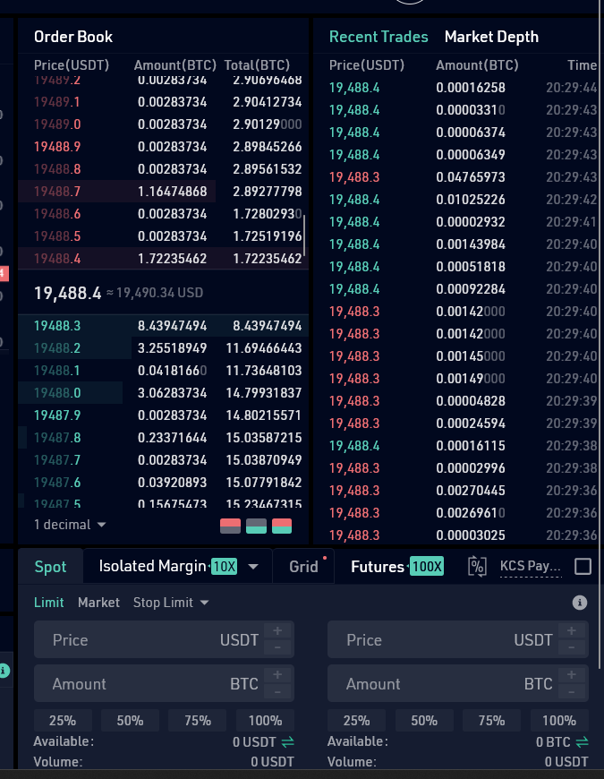

# Использование KuCoin

Дано: криптовалютная биржа с поддержкой спотовой, маржинальной и фьючерсной торговли. На ней представлено 440 криптовалют в 830 парах.
Документация: https://docs.kucoin.com/#general
## Протоколы
KuCoin использует:
1. REST API
2. WebSocket
###### REST API - технология позволяет получать и модифицировать данные и состояния удаленных приложений, передавая HTTP-вызовы через интернет или любую другую сеть.
###### WebSocket - это передовая технология, которая позволяет создавать интерактивное соединение между клиентом (браузером) и сервером для обмена сообщениями в режиме реального времени. Веб-сокеты, в отличие от HTTP, позволяют работать с двунаправленным потоком данных, что делает эту технологию совершенно уникальной.

### Order book
Беру в пример: https://www.kucoin.cloud/trade/BTC-USDT

Используя документацию, открываю консоль, где ввожу запрос 'order-book' выдается данный запрос с параметром GET, который читает данные с сайта.

Переходя по данному запросу https://www.kucoin.com/_api/order-book/orderbook/level2?symbol=BTC-USDT&limit=500&c=e667ef0837074beba45e6ac0a6cf7de7&lang=en_US

Level 2 включает все заявки и запросы (агрегированные по цене). Этот уровень возвращает только один агрегированный размер для каждой цены (как если бы был только один заказ по этой цене).

### Лента сделок

https://www.kucoin.com/_api/order-book/histories?symbol=BTC-USDT&c=e667ef0837074beba45e6ac0a6cf7de7&lang=en_US

Запрос идет через эту конечную точку, где мы получаем ленту сделок данной валюты.

### График цены (snapshot + обновления)
https://www.kucoin.com/_api/trade-front/market/getSymbol/noSerialize/BTC?lang=en_US

Запрос представляет собой график цены на рынке, которая указана или была указана в тот или иной момент по рыночному показателю.

